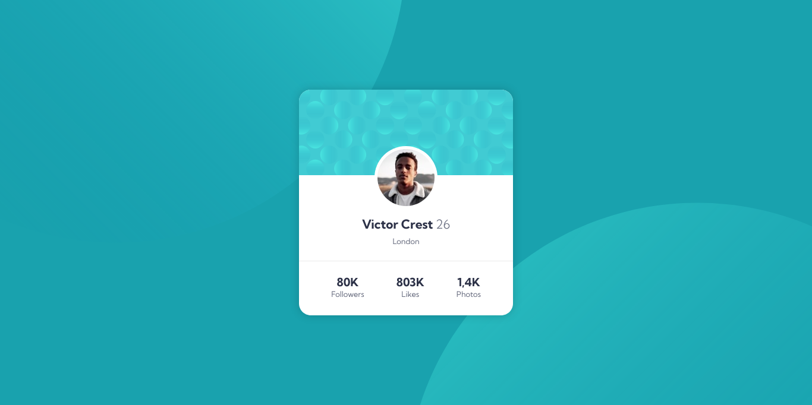

# Frontend Mentor - Profile card component solution

This is a solution to the [Profile card component challenge on Frontend Mentor](https://www.frontendmentor.io/challenges/profile-card-component-cfArpWshJ). Frontend Mentor challenges help you improve your coding skills by building realistic projects. 

## Table of contents

 - [Overview](#overview)
    - [The challenge](#the-challenge)
    - [Screenshot](#screenshot)
 - [My process](#myprocess)
    - [Built with](#built-with)
    - [My process](#my-process)
    - [Continued development](#continued-development)

## Overview

### The challenge

I have to make a page that is closest as possible to this design:

### Screenshot

My solution:

## My process

### Built with

- Semantic HTML5 markup
- CSS custom properties
- Flexbox

### What I learned

The project itself was simple, but I tried making it with new mentalities and that made the project challenging to me.

This is my first project where I focused on making a Clean Code. The cleanliness is far from perfect since it's my first project doing it, but it's my first step towards making cleaner code.
I tried to think ways to use less divs and non-semantic tags. I think I was able to do that, even though there still are parts with non-semantic tags.

This is also the first project where I planned before starting to code it. I'm not too good at this planning thing, but I did trace some steps and thought about some pieces of code that would repeat in the project and created a class or variable for them in order to make my code less verbose.
I think the best part of planning was that I found parts that would be challenging to me before writing the code. In my opinion, this saved me from doing something at the code and then need to change it because I did not consider another part of the project and then have to change it to fit this other part of the project.

Thanks to my focus on not only solving the challenging, but making the code clean and planning before coding, made me feel like I made a professional project.

### Continued development

I have a lot learn, both code-wise and mentality-wise. Even though this project is the one where I made my most clean code, I still have a lot to improve on this department.